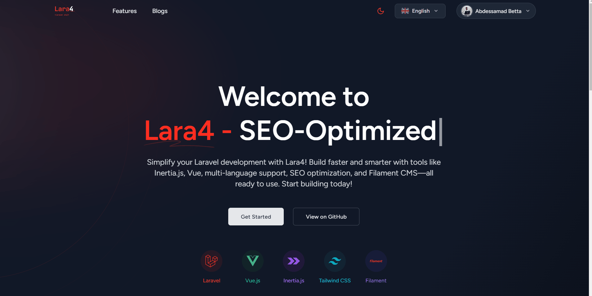

# 🚀 Lara4 - Laravel Inertia Vue Starter Kit

[](LICENSE)
[](https://laravel.com)
[](https://vuejs.org)

**A professional-grade Laravel starter kit designed for rapid development, performance, and scalability.**

> Lara4 is the perfect foundation for Laravel developers looking for a pre-configured, feature-rich environment. Built with **Inertia.js**, **Vue 3**, **Tailwind CSS**, and enhanced with multilingual support, SEO optimization, and the powerful **Filament Admin Panel**.

## 📋 Table of Contents
- [🚀 Lara4 - Laravel Inertia Vue Starter Kit](#-lara4---laravel-inertia-vue-starter-kit)
  - [📋 Table of Contents](#-table-of-contents)
  - [✨ Key Features](#-key-features)
    - [🔧 Development Experience](#-development-experience)
    - [🔐 Authentication \& Security](#-authentication--security)
    - [📦 Pre-Configured Components](#-pre-configured-components)
  - [🛠️ Quick Start](#️-quick-start)
  - [📦 Tech Stack](#-tech-stack)
  - [🔧 Installation](#-installation)
    - [Prerequisites](#prerequisites)
    - [Detailed Setup](#detailed-setup)
  - [🔗 Usage](#-usage)
    - [Access Points](#access-points)
    - [Default Admin Credentials](#default-admin-credentials)
    - [Development Commands](#development-commands)
  - [📸 Screenshots](#-screenshots)
  - [💡 Contributing](#-contributing)
  - [📝 License](#-license)
  - [👥 Community \& Support](#-community--support)

## ✨ Key Features

### 🔧 Development Experience
- **Modern Stack**: Laravel 11, Vue 3, Inertia.js, Tailwind CSS
- **Performance Optimized**: Server-Side Rendering (SSR) for faster page loads
- **Robust Admin**: Filament Admin Panel with user management, settings, and more
- **SEO Ready**: Pre-configured meta tags, sitemap, structured data
- **Multilingual**: Full i18n support (EN, FR, ES, AR) with Vue i18n
- **DevOps Friendly**: Docker & Laravel Sail configuration
- **Development Tools**: Mailpit for email testing, PhpMyAdmin for database management

### 🔐 Authentication & Security
- **Complete Auth System**: Laravel Breeze authentication
- **Social Login**: Google & GitHub integration via Laravel Socialite
- **Role Management**: Spatie Laravel Permission for access control
- **Activity Tracking**: Comprehensive user action logging

### 📦 Pre-Configured Components
- **Media Management**: Spatie Media Library for file uploads
- **Application Settings**: Spatie Settings for global configuration
- **Content Organization**: Spatie Laravel Tags
- **Data Protection**: Spatie Laravel Backup for automated backups
- **SEO Enhancements**: Spatie Laravel Sluggable for URL optimization
- **Multilingual Content**: Spatie Laravel Translatable
- **Development Tools**: Laravel Debugbar & Telescope
- **Type Safety**: Laravel Enum support

## 🛠️ Quick Start

```bash
# Clone the repository
git clone https://github.com/abdessamadbettal/Lara4.git

# Install dependencies
composer install && npm install

# Configure environment
cp .env.example .env
php artisan key:generate
php artisan storage:link

# Run migrations and seed database
php artisan migrate:fresh --seed

# Start development server
php artisan serve
npm run dev
```

## 📦 Tech Stack

| Category | Technologies |
|----------|--------------|
| **Backend** | Laravel 11, PHP 8.2+ |
| **Frontend** | Vue 3, Inertia.js, Tailwind CSS |
| **Database** | MySQL, Redis |
| **Admin** | Filament Admin Panel |
| **DevOps** | Docker, Laravel Sail |
| **Testing** | PHPUnit, Pest |
| **Utilities** | Spatie packages, Laravel Socialite |

## 🔧 Installation

### Prerequisites
- **PHP 8.2+**
- **Composer 2+**
- **Node.js & npm**
- **Docker** (optional, for Laravel Sail users)

### Detailed Setup
1. **Clone the repository:**
   ```sh
   git clone https://github.com/abdessamadbettal/Lara4.git
   cd Lara4
   ```

2. **Copy environment file and configure it:**
   ```sh
   cp .env.example .env
   ```

3. **Install dependencies:**
   ```sh
   composer install
   npm install
   ```

4. **Generate application key:**
   ```sh
   php artisan key:generate
   ```

5. **Start Docker containers (if using Sail):**
   ```sh
   sail up -d
   ```

6. **Run migrations with seeders:**
   ```sh
   php artisan migrate:fresh --seed
   ```

7. **Compile Vue i18n translations:**
   ```sh
   php artisan vue:translations
   ```

8. **Run tests to verify installation:**
   ```sh
   php artisan test
   ```

9. **Build frontend assets:**
   ```sh
   npm run build
   ```

## 🔗 Usage

### Access Points
- **Main Application**: [http://localhost](http://localhost)
- **Admin Dashboard**: [http://localhost/admin](http://localhost/admin)
- **Database Management**: [http://localhost:8080](http://localhost:8080)
- **Email Testing**: [http://localhost:8025](http://localhost:8025)

### Default Admin Credentials
- **Email**: `admin@example.com`
- **Password**: `password`

### Development Commands
- **Start development server**: `npm run dev`
- **Build for production**: `npm run build`
- **Run tests**: `php artisan test`
- **Generate enums**: `php artisan make:spatie-enum StatusEnum`
- **Create service class**: `php artisan make:service UserService`

## 📸 Screenshots

> Coming soon

## 🔒 Security

Security is a top priority for Lara4. We've included comprehensive security documentation to help you deploy safely:

**📘 [Security Documentation Index](SECURITY_INDEX.md)** - Complete guide to all security resources

### Quick Links
- **[Security Quick Fix Guide](SECURITY_QUICK_FIX.md)** - Immediate solutions for common security issues
- **[Security Best Practices](SECURITY_BEST_PRACTICES.md)** - Comprehensive security guidelines
- **[Deployment Checklist](DEPLOYMENT_CHECKLIST.md)** - Pre-deployment security verification
- **[Security Policy](SECURITY.md)** - How to report security vulnerabilities

### Quick Security Tips

⚠️ **Critical: Before deploying to production**

1. **Never use `APP_DEBUG=true` in production** - Exposes sensitive information
2. **Always generate a unique `APP_KEY`** - Never use the example key
   ```bash
   php artisan key:generate
   ```
3. **Secure your `.env` file** - It should never be committed or web-accessible
   ```bash
   chmod 600 .env
   ```
4. **Use strong database passwords** - Minimum 16 characters, mixed case, numbers, symbols
5. **Enable HTTPS** - Never run production sites without SSL/TLS
6. **Keep dependencies updated** - Run `composer audit` and `npm audit` regularly

**📖 For complete security guidance, start with [SECURITY_INDEX.md](SECURITY_INDEX.md)**

## 💡 Contributing

We welcome contributions to make Lara4 even better!

1. Fork the repository
2. Create your feature branch (`git checkout -b feature/amazing-feature`)
3. Commit your changes (`git commit -m 'Add some amazing feature'`)
4. Push to the branch (`git push origin feature/amazing-feature`)
5. Open a Pull Request

Please read our Contributing Guide for more details.

## 📝 License

This project is licensed under the MIT License - see the LICENSE file for details.

## 👥 Community & Support

- **GitHub Issues**: [Report bugs or request features](https://github.com/abdessamadbettal/Lara4/issues)
- **GitHub Discussions**: [Ask questions and share ideas](https://github.com/abdessamadbettal/Lara4/discussions)
- **linkedin**: [@abdessamadbettal](https://www.linkedin.com/in/abdessamadbettal)
- **Website**: [https://lara4.com](https://lara4.com)

---

<p align="center">
  Made with ❤️ by <a href="https://github.com/abdessamadbettal">Abdessamad Bettal</a>
</p>
